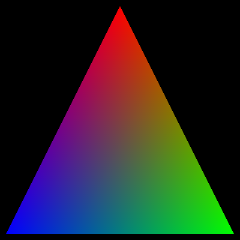
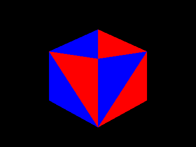

# pixels.h

A small library for drawing onto a pixels canvas, pixel by pixel cause pixels are the pixel to my pixels.

Idea born out of [tsoding/olive.c](https://github.com/tsoding/olive.c) and just thought it would be a cool idea to try out.
Admittedly I wrote this without actually looking into the olive.c code, I just grabbed the idea and ran with it.

Not really recommended to use this at all.

